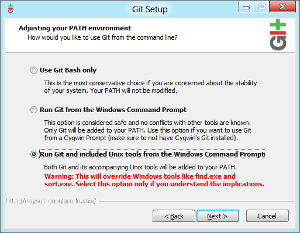
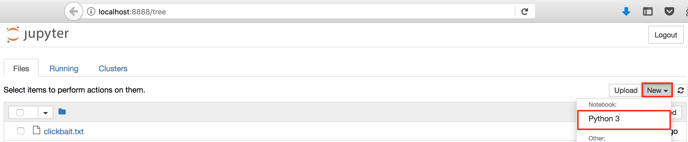
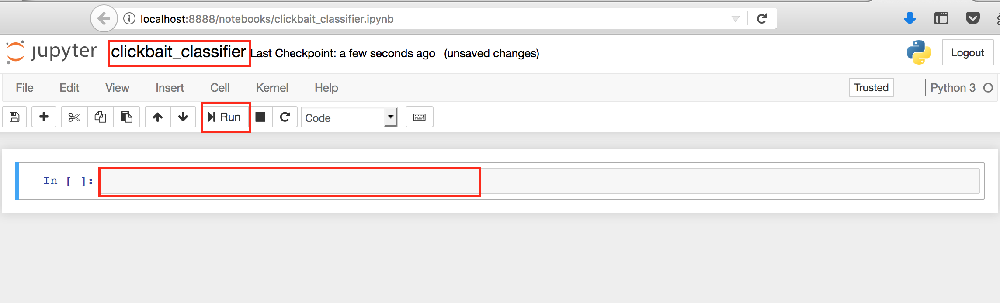

# Introduction to Machine Learning with Python's Scikit-Learn

In this post, we'll be walking through a basic machine learning project, step by step. It is aimed at people with some knowledge of programming (preferably Python), but who do not yet have experience with Machine Learning. By the end of this post, you'll understand what machine learning is and how it can help you. Furthermore, you'll be able to build your own machine learning classifiers for any dataset you want.

More specifically, we'll teach a computer to distinguish between "clickbait" headlines and "normal" headlines, where the former are those irritating "You won't believe what x does to y" type headlines that deliberately withhold information from a headline in an attempt to make people click through to the article.  

Traditionally, to write such a classifier, we would manually inspect hundreds of clickbait headlines and try to identify patterns to differentiate them from "good" headlines. We would then write a script with a lot of hand-crafted rules that tries to discriminate between clickbait headlines and good ones. This is a time consuming process that requires an expert to create the rules, and further requires a lot of code maintenance, as we would probably need to continuously update and modify the rules. 

Using a machine learning approach, we don't need to write any rules at all. We simply choose a machine learning algorithm and "show" it many labelled examples of clickbait and non-clickbait headlines. The algorithm then learns rules on its own — hopefully rules that can generalise to new data that the machine hasn't yet seen. 

## Requirements for following this tutorial

We will be writing our classifier in Python 3 using the scikit-learn library. You should have Python set up on your computer and be able to install third-party modules through pip or conda. If you need help with this step, there is an [excellent tutorial](https://tutorial.djangogirls.org/en/python_installation/) available from Django Girls that gives you step-by-step instructions for all platforms. 

You can edit the example code in any text editor or IDE of your choice, and run them using the Python integrated with your IDE or through a command line call. However, we highly recommend that you use [Jupyter Notebook](http://jupyter.org/), a browser-based application that allows you to edit and run Python code in a modular fashion. In [our accompanying GitHub repository](https://github.com/sixhobbits/sklearn-intro), we provide the code as a Jupyter Notebook, which you can download and play around with. The repository also contains the code as plain .py files if you prefer not to use Jupyter.

Preferably, you should have some existing Python knowledge, but we'll be explaining each step in depth, so if you know any other languages, such as Java, JavaScript, or C++, you should be able to keep up.

The rest of this tutorial assumes a Linux or Mac environment. If you're comfortable running Python in Windows, and know how to create new files and directories, you should have no problem adapting the commands. If you're using Windows, you should consider installing [Git for Windows](https://git-scm.com/download/win) and choosing to install the included Unix tools during the installation process, as shown below. This will ensure that most of the commands we use later in this tutorial work as expected.



## Setting up our project

The first thing we'll do is create a project directory, and install our dependencies within a virtual environment. Run the following commands in your Terminal or command prompt.

```shell
mkdir ~/clickbait
cd ~/clickbait
virtualenv clickbait-env
source clickbait-env/bin/activate
```

With the above, we create a project directory named `clickbait`, and navigate to this new directory. We then create a new Python virtual environment and activate it. If you have trouble with any of the above steps, see the [official virtualenv installation docs](https://virtualenv.pypa.io/en/stable/installation/) or [this guide](http://timmyreilly.azurewebsites.net/python-pip-virtualenv-installation-on-windows/) to get everything set up with Windows. 

### Installing the dependencies

Now we can install the libraries that we'll be using, which are Jupyter (optional), and scikit-learn. In your shell, you'll see that the new virtual environment that we created is active because its name will be in parentheses at the start of your prompt. For example, my prompt looks as follows:

```shell
(clickbait-env) ~/clickbait g$
```

You can install the dependencies we need using pip, as follows:

```shell
pip install jupyter numpy scipy scikit-learn
```

If this does not work as expected, refer to the [Jupyter installation guide](http://jupyter.org/install.html) and [scikit-learn installation docs](http://scikit-learn.org/stable/install.html). Specifically, scikit-learn relies on Numpy and SciPy. These can be a bit tricky to install, especially on Windows, so you might want to look into using Conda or WinPython, as suggested in the scikit-learn documentation if you have any problems.

### Getting the dataset

We'll be using a dataset of labelled clickbait and normal headlines derived from the dataset used by the researchers of [this paper](http://cse.iitkgp.ac.in/%7Eabhijnan/papers/chakraborty_clickbait_asonam16.pdf). The original dataset is available at [their GitHub repository](https://github.com/bhargaviparanjape/clickbait/), but we'll be using a subset of this, which I've made available as a [single .txt file](https://raw.githubusercontent.com/sixhobbits/sklearn-intro/master/clickbait.txt). Download this .txt file into your project directory. You can do this by navigating to the file using your web browser, or by running the following command in your shell:

```shell
wget https://raw.githubusercontent.com/sixhobbits/sklearn-intro/master/clickbait.txt
```

### Understanding the data

Let's take a quick look at the data to understand what our goal is. If you open up the `clickbait.txt` file in your favourite editor, you'll see the first few lines looks like this:

```
Egypt's top envoy in Iraq confirmed killed  0
Carter: Race relations in Palestine are worse than apartheid    0
After Years Of Dutiful Service, The Shiba Who Ran A Tobacco Shop Retires    1
In Books on Two Powerbrokers, Hints of the Future   0
These Horrifyingly Satisfying Photos Of "Baby Foot" Will Haunt You  1
You've Definitely Had These Arguments With Your BFF 1
11 Reasons Leslie Knope Is The Queen Of Compliments 1
```

Each line contains a headline, followed by a tab character (`\t`), followed by either a `1` or a `0`. Clickbait headlines are indicated by `1`, and normal headlines by `0`. Although all of these examples have already been labelled, we want to train a computer to "predict" the label, looking only at the headline. That is, our machine learning algorithm should look at the text of the headline and decide whether to assign a positive label, 1, to indicate that the headline looks like clickbait, or a negative label, 0, to indicate that the headline looks normal.

## Writing the code

Now that everything is set up, we can get straight into writing some Python code. The instructions below assume that you installed Jupyter notebook above and are going to be using this. If you prefer to follow along without Jupyter notebook, simply put the same code in a `.py` file, and run it as usual.

### Creating a Python notebook with Jupyter

Start up Jupyter Notebook from your project directory (with the virtual environment still activated) and create a new Python notebook. You can do this by running the following command in your shell, which should open your web browser and navigate to the Jupyter web application automatically:

```shell
jupyter notebook
```

You can now create a new Python notebook by selecting "New" in the top right hand corner, and choosing to create a Python 3 notebook, as indicated below:



In the newly created notebook, change the notebook's name to `clickbait_classifier`, by clicking on the title (indicated by the top red rectangle in the image below). You can add any Python code you want to the cell indicated by the bottom red rectangle, and run the code by pressing the "run" button (as indicated by the middle red rectangle).



Jupyter notebook has many features, but we'll mainly be using it for its ability to see the output of code at intermediate steps. Usually, when you run Python code, you need to write an entire script and then execute it. Using Jupyter notebook, we can write our code in smaller pieces, and run each "cell" individually. If we want to see results a specific stage, or edit some code we wrote previously, there's no need to run the entire script again, as the local variables of each cell are persisted and made available to other cells.

### Importing our dependencies

In the first cell, add the following import statements, which pull in the parts of scikit-learn that we'll be using. Once you've done this, hit `Shift + Enter` on your keyboard to run the code in that cell and insert a new cell below.

```python
from sklearn.feature_extraction.text import TfidfVectorizer
from sklearn.svm import LinearSVC
from sklearn.metrics import accuracy_score
```

In the above code, we're not running anything yet. But let's take a look at each line:

* Line 1 imports a vectorizer. We'll use this to transform our text headlines into a numerical format, as computers understand numbers much better than words. 
* Line 2 imports a Support Vector Machine (SVM) classifier. We won't be explaining the theory and mathematics behind this. If you're interested in learning more, have a look at the [Wikipedia article](https://en.wikipedia.org/wiki/Support_vector_machine) and [this post](https://generalabstractnonsense.com/2017/03/A-quick-look-at-Support-Vector-Machines/) by Irene Papakonstantinou, who provides a very clear and intuitive explanation of how SVMs work. This is the algorithm that will "learn" to distinguish between clickbait and normal headlines.
* Line 3 imports a metric calculator so that we can measure how well our classifier performs.

### Loading our dataset

In order to perform our classification task, we need to load our dataset into Python variables. Specifically, we'll split the dataset that we looked at above into two pieces — a large portion to train our classifier, and a smaller portion to evaluate it. We'll load the data into separate lists for the headlines and the labels, so in the end we'll have four lists (headlines and labels for training and testing).

Add the following code to the next cell in the notebook and run it with `Shift + Enter` again.

```python
# Load our data into two Python lists
with open("clickbait.txt") as f:
    lines = f.read().strip().split("\n")
    lines = [line.split("\t") for line in lines]
headlines, labels = zip(*lines)
```

The above code reads our `clickbait.txt` file and splits each line into its headline and label components. We then use the `zip` operator to split our list of tuples into two separate lists, one each for headlines and labels. We can have a look at how our data is structured now by outputting the first few elements of each array. In the next cell, add the following code and hit `Shift + Enter`

```python
headlines[:5]
```

This above should output the first five headlines in our dataset, which should look as follows:

```
("Egypt's top envoy in Iraq confirmed killed",
 'Carter: Race relations in Palestine are worse than apartheid',
 'After Years Of Dutiful Service, The Shiba Who Ran A Tobacco Shop Retires',
 'In Books on Two Powerbrokers, Hints of the Future',
 'These Horrifyingly Satisfying Photos Of "Baby Foot" Will Haunt You')
```

We can see that the third and fifth headline do not contain much information. These are "clickbait" headlines, and we can confirm this by looking at the first few labels. Add the following code to the next cell and run as usual:

```python
labels[:5]
```

You should see the following output:

```
('0', '0', '1', '0', '1')
```

The first label corresponds to the first headline; the second label to the second headline, and so on. We can see the 1s in the third and fifth positions, indicating that these headlines are clickbait, as we suspected from reading them. 

### Splitting our dataset into training and test sets

We could train our classifier on all the data that we have, but then it would be difficult for us to know how well it performs. It's very unlikely that the classifier will be perfect — that is, sometimes it will look at a clickbait headline and mistakenly think that it is a normal one, or vice-versa. If our data or methodology is flawed somehow, our classifier might do very badly and simply 'guess' whether headlines are clickbait or not. 

In order to evaluate our classifier, we'll only show it a portion of the data that we have. We'll call this the "training" set, as our classifier will look at the headlines and the labels, and try to find patterns which indicate that a headline is clickbait. We'll hold back some data as a "test" set. The classifier will never see the labels of the test set, but it will try to predict which headlines are clickbait based on the patterns it learned from the training set. We'll then compare the classifiers predictions with the labels that we know are correct to see how well the classifier performs.

Run the following code in a new cell to see how big our dataset is:

```python
# How big is our dataset?
len(headlines)
```

This should produce output indicating that our dataset contains 10000 examples. We'll use 8000 of these to train our classifier and hold back 2000 examples to test the classifier. We can achieve this split by running the following code in a new cell:

```python
# Break dataset into test and train sets
train_headlines = headlines[:8000]
test_headlines = headlines[8000:]

train_labels = labels[:8000]
test_labels = labels[8000:]
```

### Creating a vectorizer and classifier

We need to things to perform that actual classification. First we need a way to translate our text data into a matrix of numbers, as machine learning algorithms work by performing mathematical calculations to separate numerical points in multi-dimensional space. Luckily, scikit-learn can handle this for us, so we don't need to do these calculations ourselves!

We'll be using a vectorizing scheme known as "term frequency — inverse document frequency", or more commonly *tf-idf*. Under this scheme, each headline will be represented as a large sparse array (that is, most array elements will be 0). Each element in the array represents how often a specific word occurs in the headline. Because we can't account for every possible word, we assume that all the words in our dataset are all the words that exist in the world. Words that occur very often throughout the dataset (such as "the" and "and") are given a low weight and regarded as unimportant. Words that occur less frequently (such as "Zimbabwe") are given a higher weight and regarded as more important. You can read about the specifics of these calculations on the [tf-idf Wikipedia page](https://en.wikipedia.org/wiki/Tf%E2%80%93idf).

The second thing we need is a classifier. As discussed before, we'll be using a Linear SVM classifier. Thanks to the simplicity of scikit-learn, the vectorizer and the classifier can each be created in a single line of code. Add the following to a new cell and run it:

```python
# Create a vectorizer and classifier
vectorizer = TfidfVectorizer()
svm = LinearSVC()
```

### Training our classifier

We've created our classifier, but so far it doesn't know anything. We're now going to show it all the examples in our training set so that it can learn something useful. Because the classifier expects numerical input, we'll first convert our headlines to vectors, as discussed above. 

There are two steps to converting text data to vectors. First we need to "fit" the vectorizer. In this step, our vectorizer looks at all of the unique words in our dataset to decide how many dimensions our vectors need. Second, we call "transform" and pass our text data, which the vectorizer then converts to a matrix of vectors. In scikit-learn, we can execute both steps at once by calling the `fit_transform` function. 

We'll call `fit_transform` on our training data, which means that our vectorizer will assume that the the words found in our training set represent all the vocabulary that we're interested in. We'll only call `transform` (without `fit`) on our test set, so any words in our test set that are not in our training set will be discarded. We can create our train and test vectors by running the following code in a new cell:

```python
# Transform our text data into numerical vectors
train_vectors = vectorizer.fit_transform(train_headlines)
test_vectors = vectorizer.transform(test_headlines)
```

Now that we have vectors, we can train the classifier to look for patterns in our train set. Again thanks to scikit-learn, we can do this in a single line. Run the following code in a new cell:

```python
# Train the classifier and predict on test set
svm.fit(train_vectors, train_labels)
```

This "shows" all of our training headlines and their associated headlines to our classifier. Our SVM sees this data as points in multi-dimensional space, and attempts to find a hyperplane that separates the clickbait headlines from the others. This is in an iterative and computationally expensive process that can take a very long time for large datasets, but which should complete in a a second or less on our small dataset.

### Evaluating our classifier

Our classifier is now "trained". In theory, we can show it new headlines that it didn't see during training, and it will be able to make an educated guess about which are clickbait. Let's test it out. We'll generate "predictions" (you can think about these as educated guesses) for all of the headlines in our test set, that the classifier has not seen yet. Run the following code in a new cell:

```python
predictions = svm.predict(test_vectors)
```

The `predictions` variable now contains an array of labels, one label for each headline in our test set. If our classifier is working well, these "predictions" should be very similar to the real labels that we have in the `test_labels` array. Let's manually have a look at the first few before using the evaluation functions we used to get a bigger picture view based on all of them.

We can look at the first five headlines in our test set (which our classifier didn't see during training time) by running the following code in a new cell:

```
test_headlines[0:5]
```

This should produce the following output:

```
('The Earliest I\'ve Said "I Love You"',
 "Stop What You're Doing And Worship These Matt Bomer Pictures",
 '23 Of The Funniest "Nancy Drew" Game Memes',
 'Policeman killed in football-related violence in Italy',
 'Do You Remember Which Disney Star Sang These Lyrics')
```

We can see what our classifier thinks about each of these headlines by running the following in a new cell:

```python
predictions[:5]
```

There is some randomness used as part of the training algorithm, so your results may differ slightly. My output looks as follows:

```
array(['1', '1', '1', '0', '1'],
      dtype='<U1')
```

This means that the classifier thought that four of the first five test headlines looked like clickbait. The `0` in position four of the array indicates that it thought only the fourth headline "Policeman killed in football-related violence in Italy" isn't clickbait. Reading the headlines, we can probably agree with the classifier, but we can check the provided labels to be sure. Run the following code in a new cell:

```
test_labels[:5]
```

This should output the following, confirming that the classifier got all five cases correct:

```
('1', '1', '1', '0', '1')
```

We can compute the accuracy score of all the test cases by using the `accuracy_score` function. This is simply the number of times that the classifier was correct (when the label it predicted was the same as the label we provided) divided by the total number of labels (2000 in the case of our test set). We can get this number by running the following code in a new cell:

```python
accuracy_score(test_labels, predictions)
```

Again, your results might differ slightly due to the randomness used during training, but you should see something similar to the output below:

```
0.96099999999999997
```

This shows that our classifier got 96 per cent of the test cases correct. That is, our classifier got the correct answer in approximately 1920 out of the 2000 test cases (1920/2000 = 0.96). 

### Using our classifier

So far, we've only tested our classifier on the dataset we started with. This is useful to see how well our classifier performs, but not very practical. We already had all the labels indicating whether or not the headlines in our dataset were clickbait, so being able to create these labels automatically is not very useful. Let's make up some new data and see how well our classifier does on that. [Buzzfeed](https://www.buzzfeed.com/) is a great source of headlines are often but not always clickbait, so visit the home page and grab any headline that you want. I chose [10 Cities That Every Hipster Will Be Moving To Soon](https://www.buzzfeed.com/juliegerstein/these-are-the-top-ten-most-hipster-cities-in-america-yall) and [Vice President Mike Pence Leaves NFL Game Saying Players Showed "Disrespect" Of Anthem, Flag](https://www.buzzfeed.com/darrensands/vice-president-mike-pence-leaves-nfl-game-saying-players) (both of which are on the Buzzfeed homepage today). Let's see what our classifier thinks of these headlines.

As before, we need to vectorize these headlines before we can classify them. It's important that we use the same vectorizer that was fitted on our training set, or our classifier won't understand the resulting representation. Run the following code in a new cell:

```python
new_headlines = ["10 Cities That Every Hipster Will Be Moving To Soon", 'Vice President Mike Pence Leaves NFL Game Saying Players Showed "Disrespect" Of Anthem, Flag']
new_vectors = vectorizer.transform(new_headlines)
new_predictions = svm.predict(new_vectors)
```

We can have a look at the new predictions in a new cell. Run the following:

```python
new_predictions
```

My output is as follows:

```
array(['1', '0'],
      dtype='<U1')
```

This indicates that the classifier thought that the first headline about Hipsters is clickbait and that the second headline about Mike Pence is not. Because we do not have labels for these headlines, we have nothing but our own judgement to check our classifier's predictions against, but hopefully it's quite obvious that the classifier is right again! 

## Conclusion and moving forwards

In this tutorial, we looked at how to build a very basic machine learning classifier to discriminate clickbait headlines from normal ones. We saw how easy the high-level scikit-learn library is to use, and we looked at evaluating our classifier both on data from the original dataset, and on new data from the BuzzFeed homepage. 

Machine Learning is a large and complex topic, and we've only just scratched the surface in this post. If you want to see more practical text classification projects, have a look at my [Yelp Dataset Challenge GitHub repository](https://github.com/sixhobbits/yelp-dataset-2017) where I show how to do sentiment analysis and authorship attribution using online reviews. 

Feel free to comment below or reach out to me on [Twitter](https://twitter.com/sixhobbits) if you have questions or comments about this tutorial!

